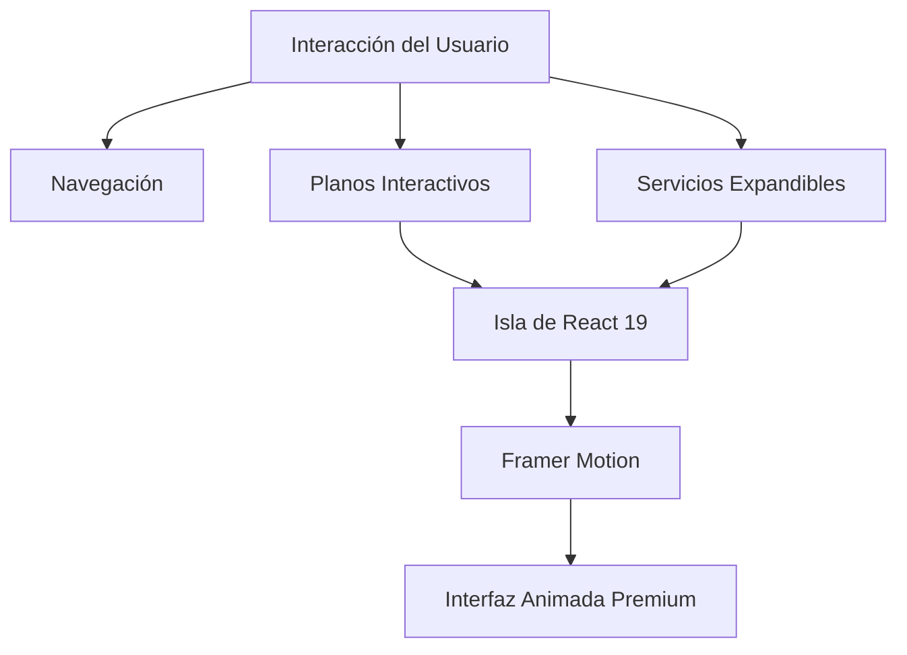

<div align="center">

# 🏢 Terral Studio

**Estudio de Arquitectura e Interiorismo de Vanguardia**

[🚀 Demo](https://terral-studio-ruben.vercel.app/) - [🐛 Incidencias](https://github.com/n3brrr/Terral-Studio/issues) - [📖 Documentación](#documentation)

</div>

---

## ⚡ Descripción General

Terral Studio es una plataforma web diseñada para un estudio de arquitectura e interiorismo ficticio en Málaga. La aplicación ofrece una experiencia inmersiva que combina la potencia de Astro 5 con islas de interactividad en React 19, permitiendo a los usuarios explorar proyectos, visualizar planos dinámicos y conocer servicios exclusivos con una estética minimalista y profesional.

### ✨ Características Principales

- 🏛️ **Visualización de Proyectos** - Galería interactiva para mostrar obras arquitectónicas con lujo de detalle.
- 📐 **Planos Dinámicos** - Visualizador de estancias que permite explorar la distribución de espacios en tiempo real.
- 🌫️ **Experiencia Smooth** - Implementación de scroll suave con Lenis y animaciones fluidas con Framer Motion.
- 🎨 **Diseño Moderno** - Interfaz totalmente responsiva y elegante impulsada por TailwindCSS v4.
- 🚀 **Rendimiento Óptimo** - Arquitectura híbrida con Astro 5 para una carga ultrarrápida y SEO amigable.

### 🛠️ Stack Tecnológico

<p align="left">


</p>

---

## 📦 Instalación

### Requisitos Previos

- Node.js 20+ (Recomendado)
- pnpm

### Configuración Rápida

```bash
# Clonar el repositorio
git clone https://github.com/n3brrr/Terral-Studio.git

# Navegar al directorio
cd Terral-Studio

# Instalar dependencias
pnpm install

# Iniciar el Servidor de Desarrollo
pnpm run dev

# Compilar para Producción
pnpm run build
```

## 📁 Estructura del Proyecto

```bash
Terral-Studio/
├── src/
│   ├── components/      # Componentes UI (Hero, Services, Proyects, HousePlan)
│   ├── layouts/         # Esquemas de página base
│   ├── lib/             # Datos de servicios, reviews y utilidades
│   ├── pages/           # Rutas del sitio (index.astro)
│   └── styles/          # Configuración de estilos y global.css
├── public/             # Recursos estáticos (imágenes y activos)
├── astro.config.mjs    # Configuración de Astro
└── package.json        # Gestión de dependencias y scripts
```

## 🔄 Arquitectura



## 🧪 Scripts

```bash
# Iniciar servidor de desarrollo
pnpm run dev

# Compilar para producción
pnpm run build

# Previsualizar compilación de producción
pnpm run preview

# Comando genérico de Astro
pnpm astro [command]
```

## 👤 Autor

**Rubén Torres** - [@n3brrr](https://github.com/n3brrr) <br>

<div align="center">
⭐ Dale una estrella a este repositorio si te resulta útil
</div>
